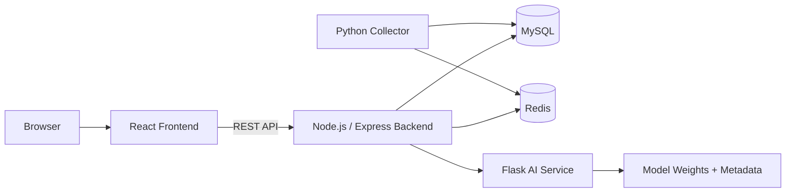

# Smart Traffic Monitoring & Prediction System

<p align="center">
  
</p>

<p align="center">
  A full-stack traffic monitoring, incident response, and short-term prediction demo system for open-source deployment and live presentation.
</p>

<p align="center">
  
  
  
  
</p>

## Overview

This project delivers an end-to-end traffic system around 11 fixed road nodes in Chengdu. It combines:

- real or mock traffic collection
- MySQL + Redis data services
- multi-horizon traffic speed prediction with an LST-GCN model
- dashboard, map monitoring, incident management, and route recommendation
- account login, role management, and deployment-oriented service separation

If you want a repo that can be cloned, started locally, and demonstrated in GitHub or on a server, this README is the main entry point.

## Feature Preview

| Module | Preview | What it does |
| --- | --- | --- |
| Dashboard |  | Shows latest traffic status, full-day trend, and prediction snapshots. |
| Map Monitor |  | Displays road nodes on an interactive AMap view with congestion coloring. |
| Incident Workflow |  | Supports report, assign, process, resolve, ignore, and delete incident records. |
| Route Recommendation |  | Compares predicted road conditions across 15/30/45/60 minute horizons. |
| Account & Settings |  | Provides login, registration, profile, password, and role-related operations. |
| AI Prediction |  | Uses the included trained model and metadata to serve short-term forecasts. |

## Architecture



## Recommended Demo Path

For first-time setup, the easiest route is:

1. Use `mock` mode instead of real-time AMap collection.
2. Backfill 24-48 hours of mock data.
3. Start backend, AI service, collector, and frontend.
4. Register a new account in the login page and open the dashboard.

This path avoids external traffic API limits and is the best choice for demos, course projects, or a public GitHub showcase.

## Prerequisites

- Node.js 20+
- Python 3.10+
- MySQL 8+
- Redis 6+
- npm and pip

Optional but recommended:

- AMap JavaScript key for the map page
- AMap Web Service key for real traffic collection
- SMTP account for email verification login

## Quick Start

### 1. Install dependencies

```bash
cd backend
npm install
```

```bash
cd frontend
npm install
```

```bash
python -m pip install -r ai_service/requirements.txt
python -m pip install -r collector/requirements.txt
```

### 2. Prepare environment files

Create the runtime config from the examples:

- root config: copy `.env.example` to `.env`
- frontend config: copy `frontend/.env.example` to `frontend/.env`

Important variables:

- `TRAFFIC_READ_SOURCE=mock`: backend reads from mock traffic data
- `TRAFFIC_COLLECTION_MODE=mock`: collector continuously generates demo data
- `VITE_API_BASE_URL=http://127.0.0.1:3001`: frontend API target
- `VITE_AMAP_KEY` and `VITE_AMAP_SECURITY_JS_CODE`: required only for the map page
- `AMAP_KEY`: required only for real traffic collection

### 3. Create the database

```sql
CREATE DATABASE traffic CHARACTER SET utf8mb4 COLLATE utf8mb4_unicode_ci;
```

The backend now auto-creates the following tables on startup when missing:

- `users`
- `incidents`
- `traffic_flow_mock`
- `predictions`

If you want a ready-made demo dataset, you can also import the included backup:

```bash
mysql -u root -p traffic < deploy_backup/traffic_20260510.sql
```

### 4. Start the AI service

```bash
python ai_service/app.py
```

Health check:

- `http://127.0.0.1:5001/health`

### 5. Start the backend

```bash
cd backend
npm run dev
```

Health check:

- `http://127.0.0.1:3001/api/health`

### 6. Generate demo traffic data

Backfill historical data first:

```bash
python collector/run_collector.py --backfill-hours 48 --backfill-interval-minutes 5
```

Then run the collector continuously:

```bash
python collector/run_collector.py
```

### 7. Trigger the first prediction

The backend has a built-in 5-minute prediction scheduler, but for a fresh demo it is better to trigger once manually:

```bash
curl -X POST http://127.0.0.1:3001/api/predict/trigger
```

On Windows PowerShell:

```powershell
Invoke-RestMethod -Method Post http://127.0.0.1:3001/api/predict/trigger
```

### 8. Start the frontend

```bash
cd frontend
npm run dev
```

Open:

- `http://127.0.0.1:5173`

## First Login

The project supports:

- username + password login
- email code login
- self-registration

For the fastest local demo:

- leave SMTP fields empty
- register with username + password
- leave email blank and use the captcha flow

## Real Traffic Collection

If you want to switch from mock data to real AMap traffic collection:

1. Set `AMAP_KEY` in the root `.env`
2. Set `TRAFFIC_COLLECTION_MODE=real`
3. Set `TRAFFIC_READ_SOURCE=real`
4. Run `python collector/run_collector.py`

Notes:

- `collector/run_collector.py` uses `collector/chengdu_collector_rect.py` in real mode
- the collector now reads database and AMap config from `.env`
- the real collector writes to `traffic_flow`

## Map Page Setup

The map page no longer uses hard-coded AMap credentials.

Set the following in `frontend/.env`:

```env
VITE_AMAP_KEY=your_amap_js_key
VITE_AMAP_SECURITY_JS_CODE=your_amap_security_code
```

Without these values:

- the frontend still runs
- the map page will show a configuration error
- dashboard, incidents, route, and account pages remain usable

## Deployment Notes

Recommended production topology:

- `frontend`: build with Vite and serve via Nginx
- `backend`: run as a long-lived Node.js service
- `ai_service`: run as a Flask service
- `collector`: run as an independent Python service
- `MySQL` and `Redis`: keep on the same server or private network

### Frontend build

```bash
cd frontend
npm run build
```

### Backend build

```bash
cd backend
npm run build
```

### Nginx example

```nginx
server {
    listen 80;
    server_name your-domain.com;

    root /path/to/traffic-system/frontend/dist;
    index index.html;

    location / {
        try_files $uri /index.html;
    }

    location /api/ {
        proxy_pass http://127.0.0.1:3001;
        proxy_set_header Host $host;
        proxy_set_header X-Real-IP $remote_addr;
        proxy_set_header X-Forwarded-For $proxy_add_x_forwarded_for;
    }
}
```

### Suggested service split

- backend: `node backend/dist/index.js`
- ai_service: `python ai_service/app.py`
- collector: `python collector/run_collector.py`

## Project Structure

```text
traffic-system/
├── frontend/               # React frontend
├── backend/                # Node.js + Express backend
├── ai_service/             # Flask inference service
├── collector/              # real/mock traffic collectors
├── model/                  # training data, scripts, and artifacts
├── deploy_backup/          # optional SQL backup for fast demo bootstrapping
├── test/                   # test scripts
├── .env.example            # backend / collector / AI example config
└── README.md
```

## API Highlights

- `GET /api/health`: backend health status
- `GET /api/traffic/latest`: latest traffic data by node
- `GET /api/dashboard/chart`: dashboard time-series data
- `POST /api/predict/trigger`: trigger a new prediction snapshot
- `GET /api/predict/latest`: latest prediction results
- `GET /api/route/outlook`: multi-horizon route recommendation data
- `GET /api/incidents`: incident list
- `POST /api/auth/register`: user registration
- `POST /api/auth/login`: password login

## Open Source Readiness

This repository is now organized for public demonstration and deployment:

- runtime configuration is documented through example env files
- frontend map credentials are moved out of source code
- real collectors can read `.env` instead of local hard-coded settings
- empty databases can bootstrap core runtime tables automatically

## Known Limitations

- the map page depends on AMap credentials and internet access
- email login requires a working SMTP configuration
- the trained model is tailored to the current 11-node topology
- some historical scripts and comments still reflect the original graduation-project context

## Next Recommended Improvements

- replace icon-style previews with actual product screenshots or GIF demos
- add Docker Compose for one-command deployment
- add GitHub Actions for lint, build, and smoke tests
- provide English README and API docs if you want broader public sharing

## License

Choose and add an open-source license file before publishing the repository publicly.
