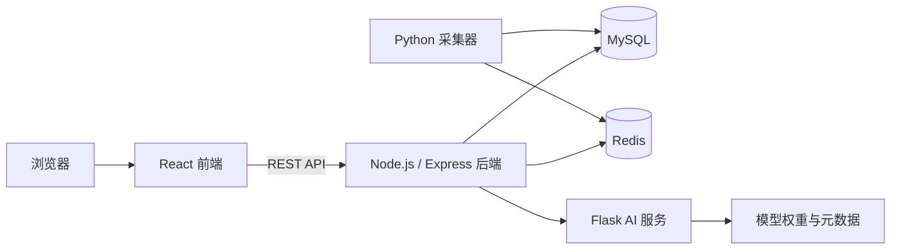

# 智能交通监测与预测系统

<p align="center">
  
</p>

<p align="center">
  一个面向演示、部署与开源展示的全栈智能交通监测、事件处置与短时预测系统。
</p>

<p align="center">
  
  
  
  
</p>

## 项目简介

本项目围绕成都 11 个固定交通节点，构建了一套完整的智能交通演示系统，包含：

- 实时或模拟交通数据采集
- MySQL + Redis 数据存储与缓存
- 基于 LST-GCN 的多时间跨度交通速度预测
- Dashboard 可视化监控
- 地图路况展示
- 交通事件上报与处置
- 路口通行推荐与路径决策参考
- 用户登录、注册、角色管理

这份 README 重点面向：

- 别人第一次访问你的 GitHub 仓库时快速看懂项目
- 本地快速跑通系统
- 云端服务器部署与演示

## 在线演示

- 演示地址：`http://1.14.68.203`

如果你的云端服务处于运行状态，访问者可以直接通过这个地址打开系统。

## 功能预览

| 模块 | 预览 | 说明 |
| --- | --- | --- |
| Dashboard 监控台 |  | 展示最新路况、全天趋势、预测结果与核心指标。 |
| 地图监控 |  | 在高德地图上展示路口节点与拥堵状态。 |
| 事件管理 |  | 支持事件上报、分配、处理、忽略、删除与状态流转。 |
| 通行推荐 |  | 对比 15/30/45/60 分钟预测结果，给出通行建议。 |
| 账号与设置 |  | 支持登录、注册、资料维护、密码管理与角色相关操作。 |
| AI 预测服务 |  | 基于仓库内已提供的模型权重与元数据提供预测能力。 |

## 系统架构



## 推荐演示路径

第一次部署或给别人演示时，建议使用下面这条路径：

1. 使用 `mock` 模式，不依赖真实路况接口配额。
2. 先回填 24 到 48 小时的模拟历史数据。
3. 启动后端、AI 服务、采集器与前端。
4. 注册一个新账号并进入 Dashboard。

这样最稳，适合：

- GitHub 开源仓库展示
- 毕设答辩演示
- 云端服务器在线演示

## 环境要求

- Node.js 20+
- Python 3.10+
- MySQL 8+
- Redis 6+
- npm
- pip

可选但推荐：

- 高德地图前端 JS Key，用于地图页面
- 高德 Web 服务 Key，用于真实路况采集
- SMTP 邮箱配置，用于邮箱验证码登录

## 快速开始

### 1. 安装依赖

后端：

```bash
cd backend
npm install
```

前端：

```bash
cd frontend
npm install
```

Python 依赖：

```bash
python -m pip install -r ai_service/requirements.txt
python -m pip install -r collector/requirements.txt
```

### 2. 准备环境变量

先根据示例文件创建配置：

- 根目录：复制 `.env.example` 为 `.env`
- 前端目录：复制 `frontend/.env.example` 为 `frontend/.env`

关键配置项说明：

- `TRAFFIC_READ_SOURCE=mock`
  后端优先读取模拟数据表
- `TRAFFIC_COLLECTION_MODE=mock`
  采集器持续生成演示数据
- `VITE_API_BASE_URL=http://127.0.0.1:3001`
  前端本地开发时请求的后端地址
- `VITE_AMAP_KEY` 与 `VITE_AMAP_SECURITY_JS_CODE`
  地图页所需，仅地图模块依赖
- `AMAP_KEY`
  真实交通采集所需，仅真实采集依赖

### 3. 创建数据库

```sql
CREATE DATABASE traffic CHARACTER SET utf8mb4 COLLATE utf8mb4_unicode_ci;
```

后端启动时会自动补齐这些核心表：

- `users`
- `incidents`
- `traffic_flow_mock`
- `predictions`

如果你想快速得到一套现成演示数据，也可以直接导入仓库内的备份：

```bash
mysql -u root -p traffic < deploy_backup/traffic_20260510.sql
```

### 4. 启动 AI 服务

```bash
python ai_service/app.py
```

本地健康检查：

- `http://127.0.0.1:5001/health`

### 5. 启动后端服务

```bash
cd backend
npm run dev
```

本地健康检查：

- `http://127.0.0.1:3001/api/health`

### 6. 生成演示交通数据

先回填历史模拟数据：

```bash
python collector/run_collector.py --backfill-hours 48 --backfill-interval-minutes 5
```

然后持续运行采集器：

```bash
python collector/run_collector.py
```

### 7. 手动触发一次预测

后端内置了每 5 分钟自动触发的预测调度，但第一次演示建议先手动触发一次：

```bash
curl -X POST http://127.0.0.1:3001/api/predict/trigger
```

Windows PowerShell：

```powershell
Invoke-RestMethod -Method Post http://127.0.0.1:3001/api/predict/trigger
```

线上服务器触发地址：

```bash
curl -X POST http://1.14.68.203/api/predict/trigger
```

### 8. 启动前端

```bash
cd frontend
npm run dev
```

访问地址：

- 在线演示：`http://1.14.68.203`
- 本地开发：`http://127.0.0.1:5173`

## 首次登录说明

系统支持：

- 用户名 + 密码登录
- 邮箱验证码登录
- 自助注册

如果你只是本地快速演示，推荐：

- SMTP 配置先留空
- 直接使用用户名 + 密码注册
- 注册时邮箱可以不填，走图形验证码流程即可

## 真实交通采集模式

如果你想从模拟数据切换到真实高德路况采集，需要：

1. 在根目录 `.env` 中配置 `AMAP_KEY`
2. 设置 `TRAFFIC_COLLECTION_MODE=real`
3. 设置 `TRAFFIC_READ_SOURCE=real`
4. 运行 `python collector/run_collector.py`

补充说明：

- `collector/run_collector.py` 的真实模式默认会走 `collector/chengdu_collector_rect.py`
- 真实采集器现在已经支持从 `.env` 读取数据库与高德配置
- 真实采集数据写入 `traffic_flow`

## 地图页面配置

地图页已不再使用前端硬编码高德配置。

请在 `frontend/.env` 中设置：

```env
VITE_AMAP_KEY=your_amap_js_key
VITE_AMAP_SECURITY_JS_CODE=your_amap_security_code
```

如果未配置：

- 前端仍然可以启动
- 地图页会提示配置缺失
- Dashboard、事件页、通行推荐、登录等模块仍可正常使用

## 部署说明

推荐生产部署结构：

- `frontend`
  使用 Vite 打包后由 Nginx 托管
- `backend`
  作为长期运行的 Node.js 服务
- `ai_service`
  作为独立 Flask 服务
- `collector`
  作为独立 Python 服务运行
- `MySQL` 与 `Redis`
  建议部署在同一台服务器或内网环境

当前项目对外访问入口：

- `http://1.14.68.203`

### 前端打包

```bash
cd frontend
npm run build
```

### 后端打包

```bash
cd backend
npm run build
```

### Nginx 配置示例

```nginx
server {
    listen 80;
    server_name 1.14.68.203;

    root /path/to/traffic-system/frontend/dist;
    index index.html;

    location / {
        try_files $uri /index.html;
    }

    location /api/ {
        proxy_pass http://127.0.0.1:3001;
        proxy_set_header Host $host;
        proxy_set_header X-Real-IP $remote_addr;
        proxy_set_header X-Forwarded-For $proxy_add_x_forwarded_for;
    }
}
```

### 推荐服务启动方式

- 后端：`node backend/dist/index.js`
- AI 服务：`python ai_service/app.py`
- 采集器：`python collector/run_collector.py`

如果你后续需要，我还可以继续帮你补：

- `systemd` 服务文件
- 一键部署脚本
- Docker Compose

## 目录结构

```text
traffic-system/
├── frontend/               # React 前端
├── backend/                # Node.js + Express 后端
├── ai_service/             # Flask 推理服务
├── collector/              # 真实/模拟交通采集器
├── model/                  # 训练脚本、训练数据与模型产物
├── deploy_backup/          # 可选 SQL 备份
├── test/                   # 测试脚本
├── .env.example            # 根目录环境变量示例
└── README.md
```

## 主要接口

- `GET /api/health`
  后端健康检查
- `GET /api/traffic/latest`
  获取每个节点的最新交通数据
- `GET /api/dashboard/chart`
  获取 Dashboard 图表数据
- `POST /api/predict/trigger`
  手动触发预测
- `GET /api/predict/latest`
  获取最新预测结果
- `GET /api/route/outlook`
  获取多时域通行建议
- `GET /api/incidents`
  获取事件列表
- `POST /api/auth/register`
  用户注册
- `POST /api/auth/login`
  密码登录

## 开源化调整

为了让项目更适合公开发布和部署，这次已经完成了这些整理：

- README 改成面向演示、使用与部署的结构
- 增加 `.env.example` 与 `frontend/.env.example`
- 前端地图配置移出源码，改为环境变量
- 真实采集器支持读取 `.env`
- 后端支持在空数据库中自动补齐核心运行表

## 当前限制

- 地图页依赖高德地图配置与外网访问
- 邮箱验证码登录依赖 SMTP 配置
- 当前模型是围绕现有 11 个节点训练与设计的
- 仓库里仍保留部分原始毕业设计开发痕迹与历史脚本

## 建议的下一步优化

- 增加真实系统截图或 GIF 演示，而不只是图标预览
- 增加 Docker Compose，一条命令启动全部服务
- 增加 GitHub Actions 做构建与基本检查
- 增加中英文双语 README
- 增加 `LICENSE` 文件，方便正式开源发布

## License

在正式公开仓库前，建议补充一个明确的开源许可证文件，例如 `MIT`、`Apache-2.0` 或 `GPL-3.0`。
